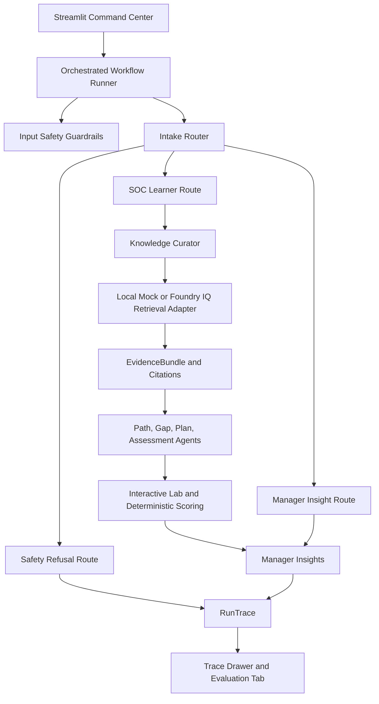

# Submission Architecture

The submission app is a local multi-agent workflow with three execution modes:

- `mock`: deterministic default mode with no cloud credentials.
- `foundry`: optional model-backed mode for selected reasoning agents.
- `foundry_iq`: model-backed mode plus live Foundry IQ / Azure AI Search knowledge base retrieval.

1. Streamlit collects the selected synthetic learner and demo request.
2. `run_demo_workflow` loads runtime config and delegates to `OrchestratedWorkflowRunner`.
3. The runner creates `WorkflowState`, evaluates input safety, and executes the Intake Router.
4. The route chooses one branch: SOC learner flow, manager insight flow, or safety refusal flow.
5. `AgentExecutor` invokes each registered agent, parses raw JSON through Pydantic, records trace steps, and performs one repair/fallback cycle on invalid output.
6. The retrieval adapter returns validated evidence: `LocalMockRetrievalAdapter` in mock/foundry mode, or `FoundryIqRetrievalAdapter` in `foundry_iq` mode.
7. Knowledge Curator consumes the adapter-provided `EvidenceBundle` instead of replacing it with deterministic evidence.
8. Scenario Lab Coach loads one of four synthetic labs; Lab Scoring Agent scores selected or custom learner responses into a typed `LabAttempt`.
9. Assessment consumes the parsed `LabAttempt` and adapts the readiness verdict and remediation sprint.
10. The local evaluation runner executes synthetic JSONL cases against the public workflow in deterministic `mock` mode and computes judge-facing metrics.
11. Streamlit renders the selected route and exposes `RunTrace` with raw JSON, parsed output, lab score, adaptive remediation reason, citations, guardrail verdicts, model metadata, retrieval metadata, repair/fallback metadata, route, fallback mode, and latency.

In `foundry` mode, Certification Path Advisor, Skill Gap Analyst, Study Plan Generator, Assessment, and Manager Insights use `FoundryBackedAgent`. The router, safety refusal, knowledge curator, scenario lab, and lab scoring remain deterministic for reliability and safety. Foundry calls are isolated behind `FoundryModelClient`, which uses Microsoft Entra ID and a Foundry project endpoint to obtain an OpenAI-compatible client.

In `foundry_iq` mode, `FoundryIqRetrievalAdapter` calls the Azure AI Search knowledge base retrieve API with `DefaultAzureCredential`, normalizes returned response chunks and references into citations, and records activity/subquery summaries where present. If retrieval fails or returns no citations, the adapter returns local mock evidence and marks the fallback in both `EvidenceBundle.retrieval_metadata` and `RunTrace`.

The submission still does not use direct raw index search, hosted Agent Framework, live Foundry evaluation runs in CI, or production observability services. It includes a Foundry-compatible evaluation dataset export and documentation for optional manual Foundry evaluation.
